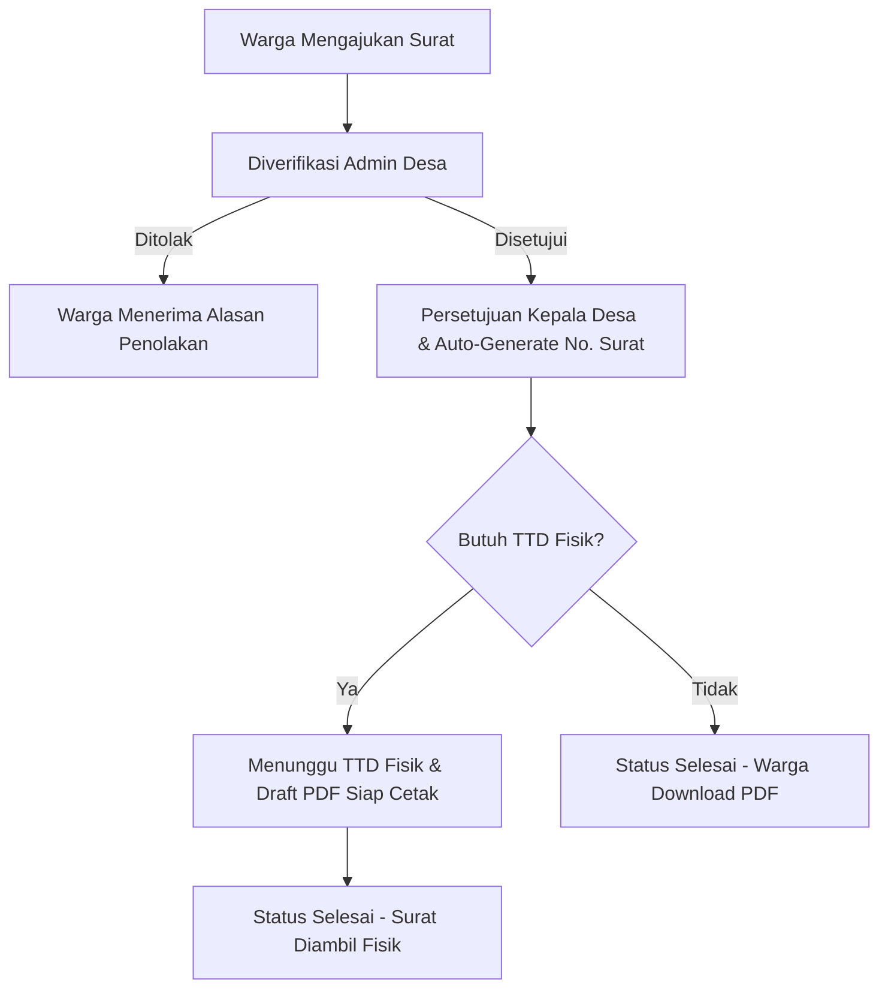

# PRESENTASI PROYEK: SILAPU (Puspamukti Smart Village)
---

## 📌 SLIDE 1: JUDUL & INFORMASI UMUM
* **Nama Platform:** **SILAPU** (Sistem Informasi Layanan Publik Puspamukti)
* **Tagline:** *"Platform Digital Terpadu Pelayanan Desa Puspamukti"*
* **Lokasi Implementasi:** Desa Puspamukti, Kecamatan Cigalontang, Kabupaten Tasikmalaya.
* **Tujuan Utama:** Digitalisasi administrasi kependudukan, pengajuan surat desa secara mandiri, transparansi anggaran, serta wadah pengaduan warga.

---

## 📌 SLIDE 2: LATAR BELAKANG & TUJUAN
* **Efisiensi Birokrasi:** Mengubah proses pengajuan surat konvensional menjadi digital guna memangkas waktu pelayanan.
* **Transparansi Publik:** Publikasi anggaran (APBDes) secara terbuka untuk meningkatkan kepercayaan warga terhadap pemerintah desa.
* **Aksesibilitas Tinggi:** Sistem login warga yang praktis menggunakan verifikasi NIK dan Nama sesuai data KTP desa (tanpa perlu repot menghafal password rumit).
* **Partisipasi Aktif:** Menyediakan wadah Musrenbang digital agar warga bisa mengusulkan ide pembangunan desa secara demokratis.

---

## 📌 SLIDE 3: TEKNOLOGI YANG DIGUNAKAN (TECH STACK)
* **Back-End Framework:** Laravel 11 (PHP)
* **Front-End Styling:** Blade Templates + TailwindCSS
* **Sistem Keamanan & Otorisasi:** `spatie/laravel-permission` (Kontrol Hak Akses/Role & Permission CRUD)
* **Export PDF:** `barryvdh/laravel-dompdf` (Untuk cetak draf surat otomatis)
* **Database:** MySQL

---

## 📌 SLIDE 4: PETA FITUR UTAMA (FEATURES)
1. **Manajemen Kependudukan:** Pendataan Kartu Keluarga (KK) dan data penduduk desa secara terstruktur.
2. **E-Pelayanan Surat:** Warga bisa mengajukan berbagai jenis surat (Domisili, Usaha, dsb.) secara mandiri dan mengunduh berkas PDF setelah disetujui.
3. **Pengaduan Warga:** Form pelaporan masalah sosial/infrastruktur desa dengan integrasi akses cepat via QR Code.
4. **Musrenbang Digital:** Fitur pengusulan ide pembangunan lengkap dengan sistem voting/dukungan antar warga.
5. **APBDes Transparan:** Grafik dan rincian realisasi anggaran desa yang dapat diakses publik kapan saja.
6. **Chat Layanan Desa:** Fitur konsultasi interaktif dua arah antara warga dan perangkat desa.

---

## 📌 SLIDE 5: ALUR KERJA PELAYANAN SURAT (FASE 1)

* **Audit Trail:** Setiap perpindahan status surat tercatat otomatis dalam `riwayat_status_surats` secara real-time.

---

## 📌 SLIDE 6: SISTEM KEAMANAN & LOGIN 2-STEP
Untuk memproteksi area administrasi, aplikasi menggunakan **2-Step Authentication** pada Form Login Warga:
1. **Step 1 (Gerbang Warga):** 
   * Input NIK & Nama Lengkap yang terdaftar di database desa.
   * **Bypass Admin:** Menggunakan NIK khusus `0000000000000000` & Nama `PUSPAMUKTI2026` atau NIK khusus `lades2026` & Nama `Layanan Desa` untuk mengarahkan ke form password admin.
2. **Step 2 (Form Password Admin):**
   * Masukkan Email/NIK Admin serta Password rahasia masing-masing perangkat desa.

---

## 📌 SLIDE 7: KREDENSIAL AKUN DEMO (DATABASE SEEDER)
*Berikut adalah daftar akun demo hasil seeder yang telah diperbarui dan disinkronkan:*

| Role | Email / NIK | Password Bawaan |
| :--- | :--- | :--- |
| **Super Admin** | `admin@puspamukti.local` / `0000000000000000` | `Admin2026` |
| **Kepala Desa** | `kepaladesa@puspamukti.local` / `3201010101010101` | `Kades2026` |
| **Sekretaris Desa** | `sekdes@puspamukti.local` / `3201010101010107` | `Sekdes2026` |
| **Bendahara** | `bendahara@puspamukti.local` / `3201010101010108` | `Bendahara2026` |
| **Admin Desa** | `admindesa@puspamukti.local` / `3201010101010109` | `AdminDesa2026` |
| **Layanan Desa** | `layanan@puspamukti.local` / `lades2026` | `Layanan2026` |
| **Warga (Test)** | `warga@puspamukti.local` / `3201010101010102` | `Warga2026` |

---

## 📌 SLIDE 8: KESIMPULAN & DEMO APLIKASI
* **Siap Pakai:** Proyek telah dikonfigurasi dengan baik, database telah dimigrasikan, dan semua akun di atas siap digunakan untuk sesi demo.
* **Dampak Positif:** Membangun kemandirian digital bagi Desa Puspamukti dan mempermudah interaksi warga dengan instansi desa.
